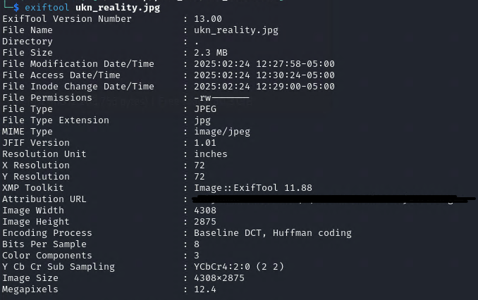
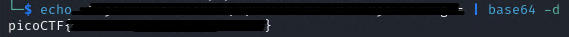

# write-up: 408 CanYouSee

## Hidden Answer

  
<strong>Click to reveal the secret answer</strong>

`picoCTF{ME74D47A_HIDD3N_3b9209a2}`

<strong>Click to reveal the steps</strong>

1. using `exiftool` for extracting the metadata of image
2. found the encoded/encrypted text on `Attribution URL`
3. the value end with `==`, guess that `base64`

4. copy the value then decode it
5. get the flag!

