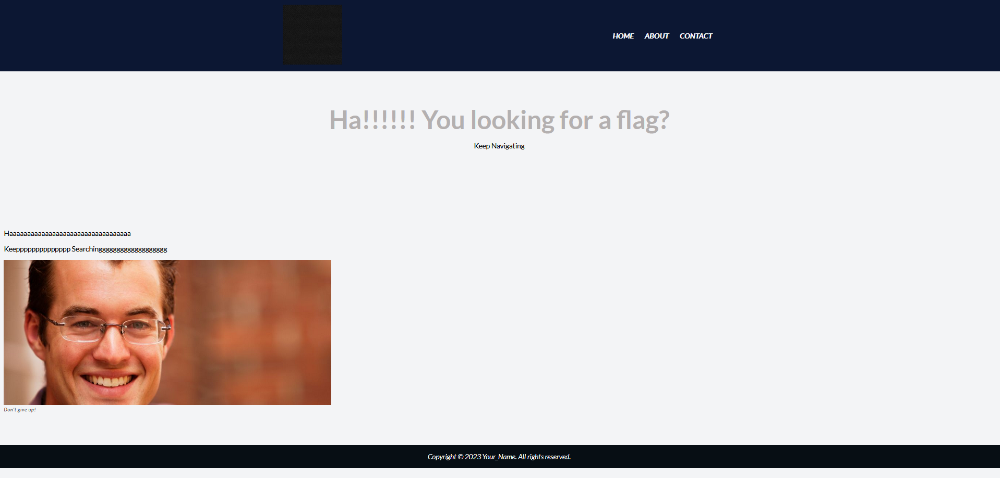
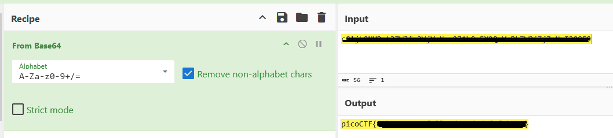

# write-up: 427 Web Decode

## Hidden Answer

  
<strong>Click to reveal the secret answer</strong>

`picoCTF{web_succ3ssfully_d3c0ded_f6f6b78a}`

<strong>Click to reveal the steps</strong>

1. Inspect each webpage
2. Looking for something like encoded/encrypted text by web inspector
3. Copy the encoded/encrypted text
4. Decode from Base64
5. Get the flag!

