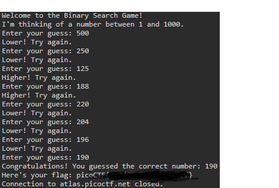

# write-up: 442 Binary Search

## Hidden Answer

  
<strong>Click to reveal the secret answer</strong>

`picoCTF{g00d_gu355_1597707f}`

<strong>Click to reveal the steps</strong>

Just try half by half

1. First, start with 500.
2. If it says "Lower!", then halve the guess value (e.g., 500 becomes 250).
3. If it says "Higher!", then calculate the new guess as the average of the
4. previous guess and the current guess (for example, (500 + 250) / 2 = 375).
5. Repeat this process until you find the correct value.

