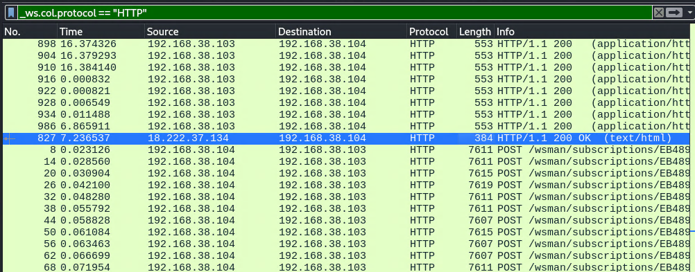
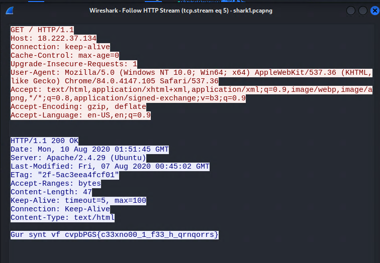
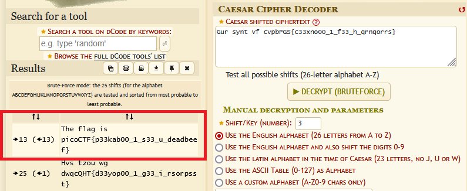

# write-up: 115 Wireshark doo dooo do doo...

## Hidden Answer

  
<strong>Click to reveal the secret answer</strong>

`picoCTF{p33kab00_1_s33_u_deadbeef}`

<strong>Click to reveal the steps</strong>

0. After digging through a bunch of encrypted packets...
1. Filter protocol to HTTP
2. Notice a suspicious packet that smelled like a clue...

<strong>Reveal the image</strong>

3. Used `Follow -> HTTP Stream` on the packet
4. We got the source of that smell!

<strong>Reveal the image</strong>

5. Recognized the **`____{ ... }`** pattern – **_classic flag format_**
6. Guess that in might be encrypted with Caesar Cipher
7. Brute-forced the decryption using `https://www.dcode.fr/caesar-cipher`

<strong>Reveal the image</strong>

8. We got the flag!

