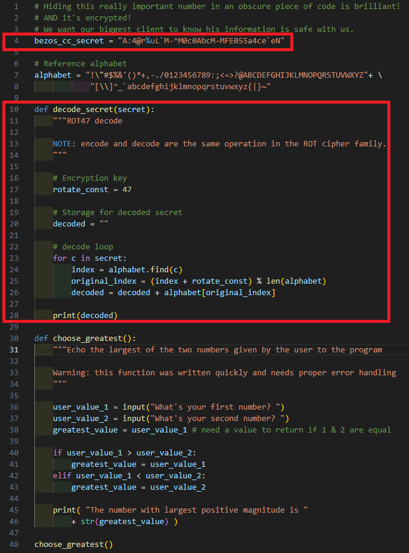
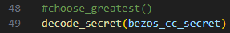

# write-up: 175 crackme-py

## Hidden Answer

  
<strong>Click to reveal the secret answer</strong>

`picoCTF{1|\/|_4_p34|\|ut_dd2c4616}`

<strong>Click to reveal the steps</strong>

1. Open the crackme.py with text editor
2. Found that there is secret and uninvoked function

Reveal the image

3. Comment the invoked function
4. Call the uninvoked function in 2. and passed the secret as an argument

Reveal the image

5. Execute crackme.py
6. Get the flag!

