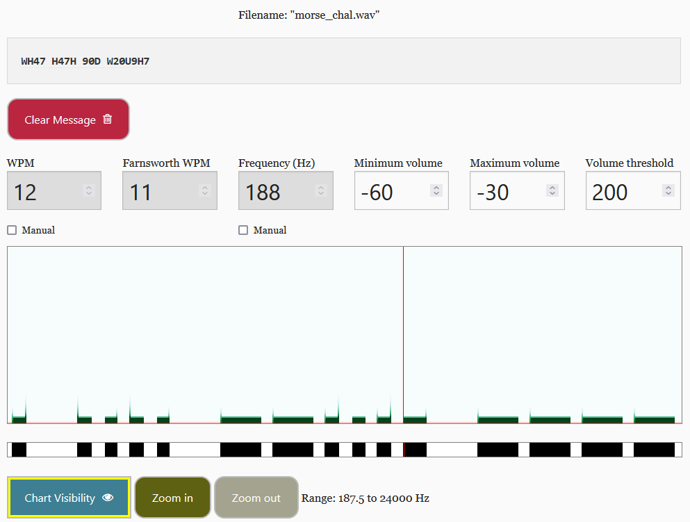

# write-up: 280 morse-code

## Hidden Answer

  
<strong>Click to reveal the secret answer</strong>

`picoCTF{WH47_H47H_90D_W20U9H7}`

<strong>Click to reveal the steps</strong>

1. Go to this `https://morsecode.world/international/decoder/audio-decoder-adaptive.html`
2. Upload `morse_chal.wav` file
3. Play sound
4. Get the decode message

Reveal the image

5. Replace blank space with `_`
6. Combine with the flag format.
7. Get the flag!

