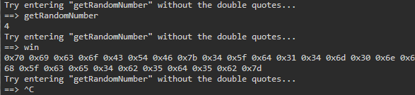

# write-up: 400 Picker I

## Hidden Answer

  
<strong>Click to reveal the secret answer</strong>

`picoCTF{4_d14m0nd_1n_7h3_r0ugh_ce4b5d5b}`

<strong>Click to reveal the steps</strong>

1. Look into the `picker-I.py`
2. Execute `nc` to the pico VM instace as following to the question
3. Notice that the `eval()` function is used for execute a command or function   For example, `eval("getRandomNumber" + '()')` # the application will invoke `getRandomNumber()`
4. Examine the code and we'll see `win()` function that read the `flag.txt` file on the server
5. Back to the `nc` we have run on 2.
6. Enter `win`

Reveal the image

 

7. We'll get a bunch of hex data
8. Use `CyberChef` to decode the hex
9. Get the flag!

 

