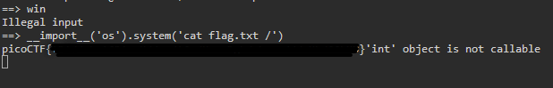

# write-up: 401 Picker II

## Hidden Answer

  
<strong>Click to reveal the secret answer</strong>

`picoCTF{f1l73r5_f41l_c0d3_r3f4c70r_m1gh7_5ucc33d_95d44590}`

<strong>Click to reveal the steps</strong>

1. Look into the `picker-II.py`
2. Execute `nc` to the pico VM instace as following to the question
3. Notice that the `eval()` function is used for execute a command or function   For example, `eval("getRandomNumber" + '()')` # the application will invoke `getRandomNumber()`
4. Examine the code and we'll see `win()` function that read the `flag.txt` file on the server
5. Not like `Picker-i` challenge, there is `filter()` function that prevents us to invoke `win()` function
6. Notice that `win()` acquire `flag.txt` by reading the file directly
7. Perform the code injection

Reveal the code injection

Enter as string

> **import**('os').system('cat flag.txt /')

 

8. Get the flag!

 

