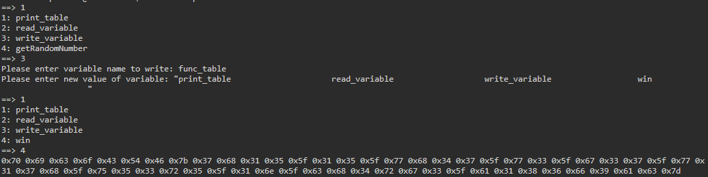

# write-up: 402 Picker III

## Hidden Answer

  
<strong>Click to reveal the secret answer</strong>

`picoCTF{7h15_15_wh47_w3_g37_w17h_u53r5_1n_ch4rg3_a186f9ac}`

<strong>Click to reveal the steps</strong>

1. Examine and investigate as `picker-i` and `picker-ii` challenges
2. Notice that the variable `func_table` is a ticket to take the flag.
3. Modify the `func_table` by enter `3` which invoke the `write_variable()` function
4. Enter `func_table` to modify its value
5. Notice that `func_table` **MUST** contains 4\*32 = 128 for length
6. Replace `getRandomNumber_________________` with `win_____________________________` (Assume `_` is `blank space` for the context)

Reveal the code injection

 

7. Enter `1` to inspect wheter the `getRandomNumber` is replaced with `win` or not
8. Enter `4` to get the encoded flag
9. Decode the hex values
10. Get the flag!

 

