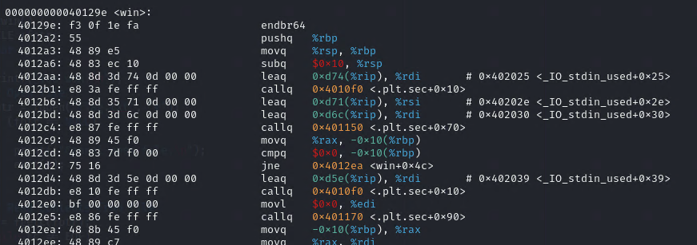

# write-up: 403Picker IV

## Hidden Answer

  
<strong>Click to reveal the secret answer</strong>

`picoCTF{n3v3r_jump_t0_u53r_5uppl13d_4ddr35535_14bc5444}`

<strong>Click to reveal the steps</strong>

1. Examine and investigate the code `picker-IV.c`
2. Notice the `void (*foo)(void) = (void (*)())val;` at LoC 47
3. Assume that the `val` should be something that relate to `win()` function, address and pointer
4. Disassemble `picker-IV` binary file
5. Found address of the `win` function

Reveal the disassembly result

 

6. `nc` to the pico VM instace as following to the question
7. Enter the address (e.g 40000e)
8. Get the flag!

 

